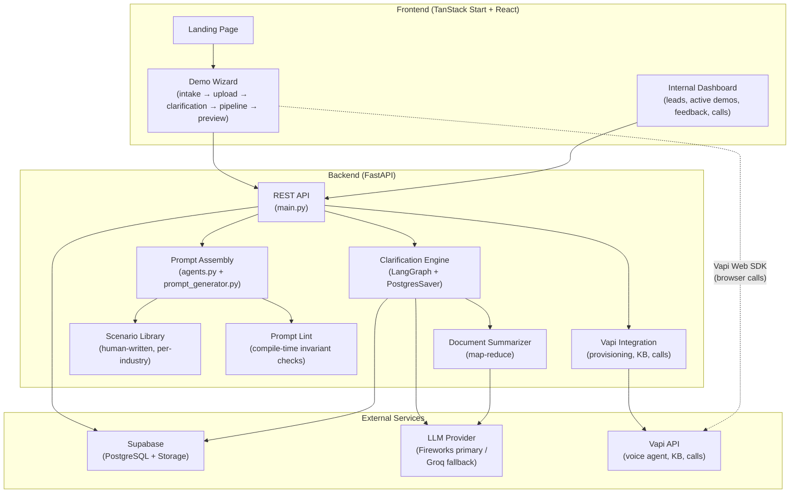

# Demoflow — Convoa Demo Automation Platform

Demoflow is the automation pipeline that takes a prospective Convoa customer from an initial intake form to a fully provisioned, personalized AI voice receptionist demo — ready for a live phone call — in roughly 10–15 minutes. It replaces what was previously a multi-day, manual sales engineering process: gathering requirements over email, writing a system prompt by hand, configuring Vapi, and sending a demo link. Now the prospect fills out a form, answers a short AI-guided scoping interview, optionally uploads an SOP document, and walks straight into a working demo they can call from their browser.

---

## High-Level Architecture

The system is a two-process stack: a **FastAPI backend** (Python, modular monolith) handling all business logic, LLM orchestration, and third-party API calls, and a **TanStack Start + React frontend** (TypeScript, Vite) that drives the multi-step wizard UI and the internal team dashboard.



### Key Integrations

| Service | Role | Accessed via |
|---------|------|--------------|
| **Supabase (PostgreSQL)** | Primary database for all tables; also hosts LangGraph's `PostgresSaver` checkpoint tables | `DATABASE_URL` env var, SQLModel ORM |
| **Supabase Storage** | Stores uploaded SOP/process documents (PDF, TXT) | `SUPABASE_URL` + `SUPABASE_SERVICE_KEY` |
| **Fireworks AI** | Primary LLM inference (structured JSON extraction, question generation, prompt generation) | `FIREWORKS_API_KEY`, OpenAI-compatible API |
| **Groq** | Fallback LLM inference (automatic failover from Fireworks) | `GROQ_API_KEY` |
| **Vapi** | Voice agent provisioning, Knowledge Base file uploads, call recording/transcript retrieval | `VAPI_API_KEY` (server), `VITE_VAPI_PUBLIC_KEY` (client) |
| **Slack Webhook** | Optional incoming webhook to send detailed lead capture notifications to your internal team | `SLACK_WEBHOOK_URL` (frontend server env var) |

### Rate Limiting & Operations

To protect downstream systems and API budgets from abuse, the application includes built-in rate-limiting and alert components:

- **SlowAPI Rate Limiting**: The backend API enforces client IP rate limits using `SlowAPI` on key routes:
  - `POST /api/clarification/{lead_id}/documents` is limited to **5 requests per minute** per IP.
  - `POST /api/clarification/{lead_id}/respond` is limited to **20 requests per minute** per IP.
- **Slack Alert Integration**: Form submissions on the onboarding wizard invoke a frontend server function (`submitLead`) which packages lead profile information and posts it directly to your Slack channel via `SLACK_WEBHOOK_URL`. If the webhook is missing, details are printed to the console output as a fallback.


---

## Complete Workflow / Data Flow

End-to-end steps from a prospect landing on the site to a live voice demo:

### Phase 1: Intake

#### Step 1: Intake Form Submission
The prospect fills out the demo request form on the frontend (`_wizard.build-demo.tsx`).
Captures: company name, contact info, industry, optional problem statement, voice preference (male/female).

#### Step 2: REST API Lead Creation
Frontend calls `POST /api/demo-request` → `create_demo_request()` in `main.py`.
- Calls `compile_lead_prompt()` in `agents.py` to render a baseline Vapi system prompt from the template (`templates/vapi_prompt_template.md`) using only intake data — no LLM, pure string substitution.
- Creates a `Lead` row with `agent_status = pending`.
- Returns `lead_id` immediately; everything below runs asynchronously.

---

### Phase 2: Document Upload (Optional)

#### Step 3: SOP Upload & Extraction
Prospect uploads an SOP/process document (PDF or TXT, max 10 MB) on the upload step (`_wizard.upload.tsx`).
- Calls `POST /api/clarification/{lead_id}/documents` → `upload_clarification_documents()`.
- File bytes go to **Supabase Storage** via `storage.upload_document()`.
- Text is extracted inline (`extract_text_from_file()` — `pypdf` for PDF, UTF-8/Latin-1 for TXT).
- A `Document` row is created with the extracted text and the Supabase public URL.

#### Step 4: AI Consent Update
Prospect gives AI processing consent via `POST /api/clarification/{lead_id}/consent`.
Records `ai_processing_consent = True` and `consent_recorded_at` on the `Lead`.

---

### Phase 3: Clarification Interview (LangGraph)

#### Step 5: Scoping Graph Initiation
Frontend kicks off the interview via `POST /api/clarification/{lead_id}/start` → `start_lead_clarification()`.
- Creates a `CompanyProfileDB` row in `in_progress` state.
- Dispatches the heavy first pass as a **FastAPI background task** (previously blocked the request for ~20s).
- Returns `in_progress` immediately; the frontend polls `GET /api/clarification/{lead_id}`.

#### Step 6: Clarification Execution Cycle
LangGraph clarification graph executes (`clarification.py`). The graph is compiled once per process with a shared `PostgresSaver` connection pool. Nodes, in order:

| Node | What it does |
|------|-------------|
| `parse_documents` | Loads extracted text from DB, runs `sanitize_document_text()` injection gate. |
| `extract_profile` | Calls the LLM with `EXTRACTION_PROMPT` to fill a `CompanyProfile` (12 structured fields) from documents + intake. |
| `detect_gaps` | Diffs filled fields against `PROFILE_FIELDS` to find what's still `UNKNOWN`. |
| `summarize_documents` | *(first pass only, if documents exist)* Calls `document_summarizer.summarize_documents()` — map-reduce over the full document text to produce a `business_brief`. Persists brief to `CompanyProfileDB.business_brief`. |
| `generate_question` | Calls the LLM with `QUESTION_PROMPT` to produce one concrete, industry-grounded scoping question + 2–4 recommended answers. Steered by missing fields, the scenario library, and already-asked topics. |
| `await_answer` | **LangGraph `interrupt()`** — pauses the graph and waits for the user's response. The frontend renders the question + recommendations. |
| `ingest_answer` | Classifies the response (`RESPONSE_CLASSIFIER_PROMPT`): direct answer vs. meta-question. Meta-questions get a helpful reply and re-pause on the same question. |
| `merge_answer` | Calls the LLM to incrementally update the profile with the new answer (not a full re-extraction). |
| `ask_final_question` | After 5–9 scoping questions, asks a single open-ended "anything else?" wrap-up. |
| `finalize` | Marks the profile `completed`, persists final state. |

#### Step 7: Continuous Interview Loop
For each scoping turn: frontend calls `POST /api/clarification/{lead_id}/respond` → `submit_clarification_answer()` resumes the graph from its checkpoint, which cycles through `ingest_answer → merge_answer → detect_gaps → generate_question → await_answer`.

#### Step 8: Early Scoping Termination
The user can click to skip remaining questions, firing `POST /api/clarification/{lead_id}/skip-remaining` to finalize profile assembly early.

---

### Phase 4: Agent Provisioning (Background)

#### Step 9: Provisioning Task Trigger
When clarification completes (or is skipped), the endpoint fires `provision_vapi_assistant_task()` as a background task. This is the heaviest pipeline stage, with three internal sub-stages that are committed to the DB so the frontend's progress indicator tracks real transitions:

| Stage (`AgentStatus`) | What happens |
|-----------------------|-------------|
| `summarizing_documents` | If documents exist, consent is given, and no pre-existing brief: runs `summarize_documents()` (map-reduce LLM calls with rate-limit pacing). |
| `building_profile` | Calls `generate_company_content_fields()` (`prompt_generator.py`) — an LLM writes the four variable slots (greeting line, business context, escalation terms/action). Then `compile_lead_prompt()` assembles the final Vapi system prompt from invariant template sections + these slots. `prompt_lint.lint_compiled_prompt()` runs advisory checks. |
| `provisioning` | Calls `_call_vapi_create_assistant()` to create a Vapi assistant (Deepgram Nova-2 transcriber, GPT-4.1 model, Vapi native voice v2). If documents passed sanitization, their original bytes are uploaded to Vapi's file library via `upload_to_knowledge_base()` and attached via `attach_knowledge_base()`. |

#### Step 10: Finalizing Local State
On success: `lead.assistant_id` is set and `agent_status` becomes `active`. The frontend detects this via polling and navigates to the demo preview.

---

### Phase 5: Demo Preview & Live Call

#### Step 11: Frontend SDK Connection
Frontend demo preview (`_wizard.demo-preview.tsx`) embeds the **Vapi Web SDK** (`@vapi-ai/web`), which connects browser audio to the provisioned assistant via `assistant_id`. The prospect can call their own AI receptionist from their browser.

#### Step 12: Call Detail Retrieval
When a call ends, the frontend calls `POST /api/demo-request/{lead_id}/calls` with the Vapi `call_id`. A background task `fetch_vapi_call_task()` polls Vapi's `GET /call/{id}` until the report (recording, transcript, summary, cost) is finalized, then stores it on a `CallRecord`.

#### Step 13: Customer Feedback Log
Prospect submits feedback via `POST /api/demo-request/{lead_id}/feedback` (thumbs up/down + optional comment). Stored in `DemoFeedback`.

---

### Phase 6: Cleanup

#### Step 14: Automated Resource Sweeper
Agent TTL: A background asyncio task (`_cleanup_expired_agents`) sweeps every 15 minutes and deletes Vapi assistants whose leads are older than 6 hours, freeing resources.

#### Step 15: Manual Team Deletion
The internal dashboard can call `DELETE /api/demo-request/{lead_id}/agent` to tear down a specific agent's Vapi resources immediately.

---

## Key Architectural Decisions and Why

### 1. Modular Monolith over Microservices
The entire backend is a single FastAPI process. At current scale (demo pipeline, not production call handling) a monolith is dramatically simpler to deploy, debug, and reason about. Splitting would add network hops, deployment complexity, and distributed-state headaches for no benefit at this stage. If individual modules (e.g. the summarizer, the provisioning task) become independently scalable bottlenecks, they're already cleanly separated and can be extracted.

### 2. LangGraph with `PostgresSaver` for Scoping
The interview is a multi-turn, stateful conversation where the graph can pause for minutes or hours waiting for a user response. LangGraph's `interrupt()` + checkpoint/resume model is a natural fit: each turn resumes from persisted state, and the graph topology (conditional routing, re-extraction loops) is explicit in code rather than hidden in a state machine. `PostgresSaver` checkpoints to the same Supabase Postgres instance the rest of the app uses, so there's no additional infrastructure.

### 3. Two-Layer Prompt (Invariant Template + Constrained LLM)
The Vapi system prompt is split into **invariant behaviour** (how the agent speaks, its restrictions, KB discipline, closing) that is human-written template text and **variable content** (who this business is, what they do, escalation specifics) that an LLM fills from gathered data. This is deliberate:
- The invariant layer is never LLM-generated, so it can't drift, hallucinate, or be prompt-injected by user-supplied content.
- The variable layer is tightly constrained: the LLM fills only four named content fields, and `prompt_lint.py` rejects leaks of invariant-layer language (e.g. "knowledge base", "let me check").
- If generation fails, `compile_lead_prompt()` falls back to deterministic slot-filling from the profile and scenario library — provisioning never breaks on a degraded LLM.

### 4. Fail-Open Architecture Design
Every external dependency has a graceful degradation path:
- **LLM Provider Fallback:** Fireworks is primary, Groq is automatic fallback. If both fail, the prompt generator returns `""` and the deterministic path handles it.
- **Supabase Storage Fail-Open:** If unconfigured/unavailable, `upload_document()` returns a mock URL in dev; document extraction still works from in-memory bytes.
- **Vapi API Mocking:** Mock assistant IDs are generated when the API key is missing/dummy, so the full flow can be exercised locally without Vapi credentials.
- **Knowledge Base Upload Fallback:** If the raw file can't be downloaded from Supabase, falls back to uploading the extracted text as `.txt`.

### 5. Scenario Library (Vetted & Human-Written)
`scenario_library.py` contains industry-specific call handling rules (HVAC, dental, legal, etc.) as explicit (trigger, action) pairs. These are the **default behaviour** when a lead provides no specifics, and they're also fed to the question generator so it doesn't ask about things the library already covers. Everything in this file is hand-reviewed — no LLM writes to it at runtime. This is the "safe floor" that stops an agent from inventing policies.

### 6. Multi-Layer Input Sanitization (Adversarial Defenses)
User-supplied text passes through multiple sanitization layers before reaching any prompt:
- `sanitize_input()` — short identifiers (company name, industry): 100 char cap, bracket/brace strip, injection keyword removal.
- `sanitize_profile_text()` — profile fields: 400 char cap, same injection patterns.
- `sanitize_document_text()` — full document text: flags and rejects documents exceeding a match threshold for injection patterns. Below threshold, strips matches but preserves content.
- The prompt template itself isolates user content in clearly labeled `{{slots}}` within a fixed structure, and the `restrictions` section is always emitted **after** any generated content.

### 7. Background Queue for Heavy Tasks
Document summarization, profile extraction, and Vapi provisioning all run as FastAPI `BackgroundTasks`, not in the request path. Endpoints return immediately with a status the frontend polls. This prevents HTTP timeouts and lets the UI show real progress stages (`summarizing_documents → building_profile → provisioning → active`).

---

## Project Structure

```
dq_demo/
├── backend/
│   ├── app/
│   │   ├── main.py                  # FastAPI app, all REST endpoints, lifespan (DB init + agent cleanup)
│   │   ├── models.py                # SQLModel table definitions (Lead, Document, CompanyProfileDB, etc.)
│   │   ├── db.py                    # Engine creation, init_db() with idempotent ALTER TABLE migrations
│   │   ├── config.py                # Env var loading (DATABASE_URL, CORS_ORIGINS, etc.)
│   │   ├── agents.py                # Prompt composition (compile_lead_prompt), Vapi assistant CRUD, provisioning task
│   │   ├── clarification.py         # LangGraph clarification workflow (graph, nodes, API interface functions)
│   │   ├── llm_client.py            # Unified LLM dispatch (Fireworks primary → Groq fallback), structured JSON output
│   │   ├── prompt_generator.py      # LLM generation of the four variable content fields for the Vapi prompt
│   │   ├── document_summarizer.py   # Map-reduce summarization of uploaded SOPs into a business brief
│   │   ├── scenario_library.py      # Human-written, per-industry call scenarios and escalation defaults
│   │   ├── prompt_lint.py           # Compile-time invariant checks on assembled prompts
│   │   ├── storage.py               # Supabase Storage upload/download (fail-open)
│   │   ├── vapi_calls.py            # Polls Vapi GET /call/{id} for native call reports (recording, transcript)
│   │   ├── vapi_knowledge_base.py   # Uploads files to Vapi's KB, attaches to assistant
│   │   ├── utils.py                 # Input sanitization (injection defense), document text sanitization
│   │   ├── logging_config.py        # Structured JSON logging to stdout
│   │   └── templates/
│   │       └── vapi_prompt_template.md  # The human-written Vapi system prompt template (invariant + variable sections)
│   ├── migrations/                  # Alembic migration versions
│   ├── tests/
│   │   ├── test_clarification.py
│   │   ├── test_clarification_dedup_and_meta.py
│   │   ├── test_modular_prompt.py
│   │   ├── test_prompt_lint.py
│   │   ├── test_reasoning_clarification.py
│   │   ├── test_summarization_bypass.py
│   │   ├── test_vapi_knowledge_base.py
│   │   └── debug_end_to_end.py
│   ├── alembic.ini
│   ├── requirements.txt
│   └── .env.example
│
├── frontend/
│   ├── src/
│   │   ├── routes/
│   │   │   ├── index.tsx                    # Landing page
│   │   │   ├── _wizard.tsx                  # Wizard layout wrapper
│   │   │   ├── _wizard.build-demo.tsx       # Step 1: Intake form
│   │   │   ├── _wizard.upload.tsx           # Step 2: Document upload + consent
│   │   │   ├── _wizard.clarification.tsx    # Step 3: AI-guided scoping interview chat
│   │   │   ├── _wizard.pipeline.tsx         # Step 4: Provisioning progress display
│   │   │   ├── _wizard.demo-preview.tsx     # Step 5: Live demo with Vapi Web SDK
│   │   │   ├── _app.tsx                     # Internal dashboard layout
│   │   │   ├── _app.dashboard.tsx           # Internal: leads overview
│   │   │   ├── _app.active-demos.tsx        # Internal: live provisioned agents
│   │   │   ├── _app.feedback.tsx            # Internal: client feedback list
│   │   │   ├── _app.voice-agent.tsx         # Internal: voice agent management
│   │   │   ├── _app.settings.tsx            # Internal: settings
│   │   │   └── portal.tsx                   # Auth-gated entry to internal dashboard
│   │   ├── components/
│   │   │   ├── ui/                          # shadcn/Radix UI primitives
│   │   │   ├── common/                      # Shared components
│   │   │   └── layout/                      # Layout components
│   │   ├── lib/
│   │   │   ├── api.ts                       # Backend API client (fetch wrappers)
│   │   │   ├── leads.ts                     # Lead-related API helpers
│   │   │   ├── auth.ts                      # Portal auth
│   │   │   ├── industry-narratives.ts       # Client-side industry display copy
│   │   │   └── mock-data.ts                 # Dev mock data
│   │   ├── hooks/
│   │   │   ├── use-mobile.tsx
│   │   │   └── use-theme.tsx
│   │   ├── styles.css                       # Global styles (Tailwind v4)
│   │   ├── router.tsx                       # TanStack Router setup
│   │   └── routeTree.gen.ts                 # Auto-generated route tree
│   ├── package.json
│   ├── vite.config.ts
│   └── tsconfig.json
│
└── .gitignore
```

---

## Database Tables

All tables are defined as SQLModel models in `backend/app/models.py` and auto-created by `init_db()`:

| Table | Purpose |
|-------|---------|
| `leads` | Core table. One row per demo request. Tracks `agent_status` lifecycle, stores `rendered_prompt`, `assistant_id`, qualification data, consent. |
| `company_profile` | 1:1 with a lead. Stores the structured `profile` (JSON), `missing_fields`, `business_brief`, and `status` of the clarification interview. |
| `documents` | Uploaded SOP/process files. `file_url` points to Supabase Storage, `extracted_text` holds the parsed content. |
| `clarification_messages` | Chat history for the scoping interview (role: `assistant` / `user`). |
| `demo_feedback` | Thumbs up/down + optional comment from the prospect after the demo. |
| `call_records` | One row per Vapi call. Stores Vapi's native report: `recording_url`, `transcript` (JSON), `summary`, `cost`, `duration_seconds`. |
| `discoveryresponse` | Legacy discovery form responses (revenue leakage calculator). |
| `voiceagent` | Legacy provisioned agents from the discovery flow. |

LangGraph's `PostgresSaver` also creates its own checkpoint tables in the same database.

---

## Setup / How to Run Locally

### Prerequisites

- Python 3.11+
- Node.js 18+ (or Bun)
- A PostgreSQL database (Supabase free tier works)

### Backend Local Setup

```bash
cd backend

# 1. Create and activate a virtual environment
python -m venv .venv
.\.venv\Scripts\Activate.ps1          # Windows PowerShell
# source .venv/bin/activate            # macOS/Linux

# 2. Install dependencies
pip install -r requirements.txt

# 3. Configure environment
cp .env.example .env
# Edit .env and fill in:
#   DATABASE_URL    — your Supabase PostgreSQL connection string
#   GROQ_API_KEY    — get one at https://console.groq.com/keys
#   VAPI_API_KEY    — your Vapi private key (optional for mock mode)
#   SUPABASE_URL    — your Supabase project URL (optional for mock mode)
#   SUPABASE_SERVICE_KEY — Supabase service role key (optional for mock mode)
#
# Optional:
#   FIREWORKS_API_KEY  — enables Fireworks as primary LLM (Groq becomes fallback)
#   LLM_PROVIDER       — pin to "groq" or "fireworks" to disable fallback

# 4. Run the server
uvicorn app.main:app --reload
# API available at http://localhost:8000
# OpenAPI docs at http://localhost:8000/docs
```

> **Mock mode:** If `VAPI_API_KEY` is missing or starts with `dummy`/`mock`, the provisioning pipeline generates mock assistant IDs and skips real Vapi calls. Similarly, if Supabase credentials are missing, storage operations return simulated URLs. This lets you run the full flow locally without any paid service.

### Frontend Local Setup

```bash
cd frontend

# 1. Install dependencies
npm install
# or: bun install

# 2. Configure environment (already has sensible defaults)
# Edit .env if your backend is not on http://localhost:8000:
#   VITE_API_BASE_URL=http://localhost:8000

# 3. Start the dev server
npm run dev
# Frontend available at http://localhost:3000
```

### Running Tests

```bash
cd backend
python -m pytest tests/ -v
```

---

## Known Limitations / Open Questions

### 1. No Authentication on the Backend API
All endpoints are open. The internal dashboard has a client-side portal password (`PORTAL_PASSWORD` env var), but the API itself has no auth middleware. Fine for demo/staging, not for production.

### 2. Schema Migrations Performed Inline
The Alembic migrations directory exists but most schema evolution happens via idempotent `ALTER TABLE ... ADD COLUMN IF NOT EXISTS` in `db.py`. This works but means migration history isn't fully tracked. Consider consolidating to Alembic-only migrations before production.

### 3. Rate-Limit Sensitive Document Summarization
The map-reduce summarizer paces chunk calls with a 4-second delay (`INTER_CHUNK_DELAY`) to stay within provider TPM budgets. A very long document (20+ pages) can take 1–2 minutes. This is acceptable but not ideal.

### 4. Polling Instead of Vapi Webhooks for Call Reporting
Call reports are fetched by polling `GET /call/{id}` (up to 20 attempts, 3s apart) in a background task. This works without a public URL but adds latency and is fragile if Vapi's report finalization takes longer than expected.

### 5. Blunt 6-Hour Agent TTL Sweeper
All expired assistants are deleted regardless of whether the prospect is still actively demoing. A more sophisticated approach would track actual session activity.

### 6. Single-Point Dependency on LLM Providers
The pipeline depends on at least one of Fireworks AI or Groq being reachable and returning valid JSON. Both providers have rate limits and occasional outages. The dual-provider fallback mitigates this but doesn't eliminate it.

### 7. Missing Production Deployment Configuration
There's no Dockerfile, no CI/CD pipeline, no infrastructure-as-code. The Vite config supports Cloudflare/Nitro builds for the frontend, but backend deployment is not codified.

### 8. Keyword-Based Prompt Injection Sanitization
The sanitization in `utils.py` uses regex pattern matching for known injection keywords. This is a practical first layer but not a comprehensive defense against adversarial prompt injection.

### 9. Scenario Library Limited Industry Coverage
Unknown industries fall back to a generic entry. The library can be extended by adding entries to `SCENARIO_LIBRARY` in `scenario_library.py`, and there's an LLM-backed `resolve_industry_entry()` that generates display names and stakes for uncovered industries at runtime — but the generated entries lack vetted call scenarios.
